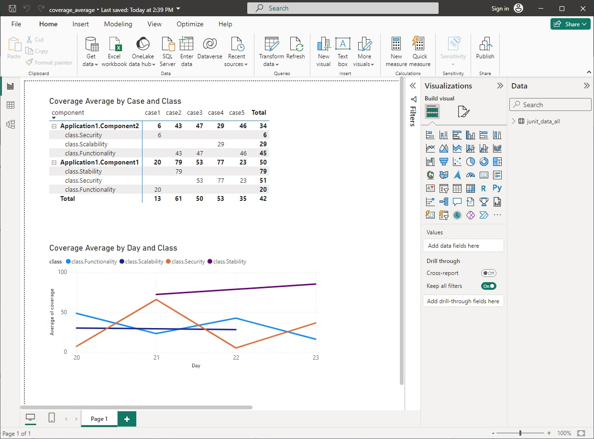

# test-collector

### Overview

This repo contains a set of Python scripts and config files that can be used to build a simple CSV database of test results and metrics from artifacts generated by CI pipelines. The CI sources as well as what file formats are supported can be customized and extended. Sample visualizations are includes to show what can be done with the resultant CSV file.

The functionality represented in this repo is intended to be a base from which more complicated and useful automation can be built.

### Components

   * core parent script that spins up a config and calls handlers and converters
   * handlers for GitHub workflows and Azure Devops (AZDO) pipelines
   * converter for JUnit XML files (to convert to CSV)
   * sample starter config files to drive the above
   * sample GitHub workflow and AZDO pipeline in YAML format that generate sample JUnit XML files
   * PyTest script for the above (using existing private pipelines)
   * sample PowerBI .pbix file that demonstrates how to load the CSV file and generate a simple dashboard of test results and metrics
   * documentation

### Setup

   * clone repo locally
   * define following env vars:
      * TEST-COLLECTOR_FILE_ROOT_PATH = root of repo
      * GITHUB_TOKEN (requires ability to read workflow artifacts)
      * AZURE_DEVOPS_PAT (requires ability to read pipeline artifacts)
   * update config\config_sources.json:
      * define desired source names in "data" section
      * for each source, specify:
         * CI handler
         * parameters for that CI system
         * pipeline or workflow id or name
         * the information about the desired artifact
   * update config\config_runs.json:
      * sections for each source
      * in each section, set last_run_id = 0
   * update config\config_options.json:
      * logging and output options

### Usage

   * from the root of the repo, run "run.cmd" (Windows batch script)
   * output will be to stdout and to the logging file specified in the config

### Output

<pre>
date,id,component,case,class,pass,coverage
2024-03-21 17:01:16,437,Application1.Component1,case1,class.Functionality,0,23
2024-03-21 17:01:16,437,Application1.Component1,case2,class.Stability,0,72
2024-03-21 17:01:16,437,Application1.Component1,case3,class.Security,1,81
2024-03-21 17:01:16,437,Application1.Component1,case4,class.Security,0,93
2024-03-21 17:01:16,437,Application1.Component1,case5,class.Security,1,23
</pre>

### Visualization

### To-Do

   * expand documentation further based on customer feedback
   * parallelize handlers

